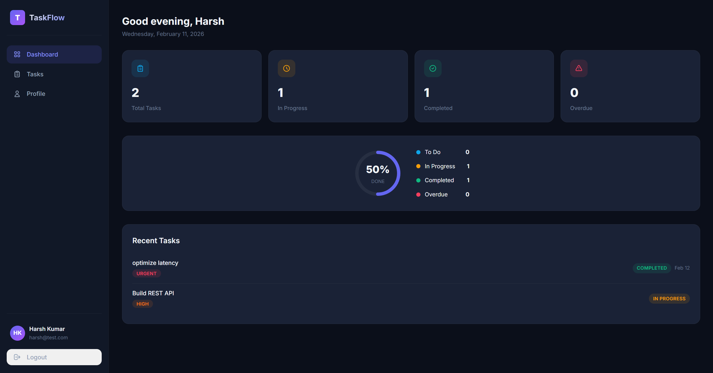
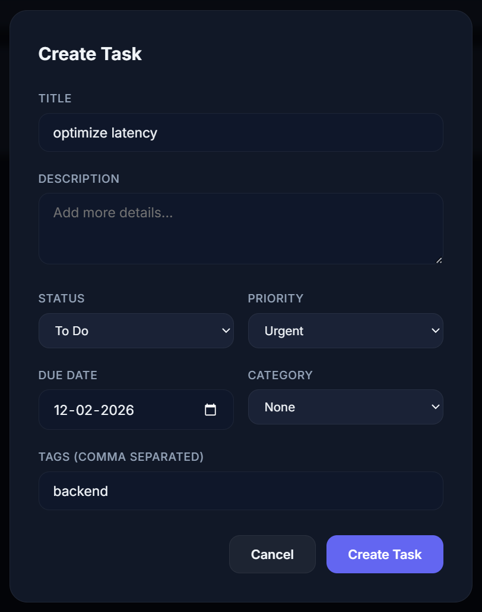

<div align="center">

# ✅ TaskFlow — Personal Task Manager

A full-stack productivity application for managing tasks with an intuitive dashboard, smart filtering, and real-time analytics.

**Built with React · Node.js · Express.js · MongoDB**



</div>

---

## ✨ Features

- **Secure Authentication** — JWT-based registration and login with bcrypt password hashing
- **Task CRUD** — Create, update, delete, and toggle task completion with rich metadata
- **Smart Filtering** — Filter tasks by status, priority, category, or search by keywords
- **Custom Categories** — Organize tasks under color-coded categories
- **Dashboard Analytics** — Visual stats cards, SVG progress ring, and recent activity feed
- **Responsive UI** — Fully responsive dark-themed interface that works on desktop and mobile



---

## 🛠 Tech Stack

| Layer | Technology |
|-------|-----------|
| **Frontend** | React 18, React Router v7, Axios, Context API, Vite |
| **Backend** | Node.js, Express.js, Mongoose, JWT, bcryptjs |
| **Database** | MongoDB (in-memory via `mongodb-memory-server`) |
| **Styling** | Vanilla CSS with custom design system (glassmorphism, dark theme) |

---

## 📁 Project Structure

```
├── server/
│   ├── config/          # Database connection
│   ├── controllers/     # Route handlers (auth, tasks, categories)
│   ├── middleware/       # JWT auth guard, global error handler
│   ├── models/          # Mongoose schemas (User, Task, Category)
│   ├── routes/          # Express route definitions
│   └── server.js        # Entry point
│
├── client/
│   ├── src/
│   │   ├── components/  # Layout, Sidebar, Navigation
│   │   ├── context/     # AuthContext, TaskContext (state management)
│   │   ├── pages/       # Login, Register, Dashboard, Tasks, Profile
│   │   ├── services/    # Axios API client with interceptors
│   │   └── App.jsx      # Root component with routing
│   └── index.html
│
├── screenshots/         # App screenshots
└── README.md
```

---

## 🚀 Getting Started

### Prerequisites

- [Node.js](https://nodejs.org/) v18 or higher

> **Note:** No MongoDB installation required — the app uses `mongodb-memory-server` which runs MongoDB in-memory automatically.

### Installation

```bash
# Clone the repository
git clone https://github.com/harsh-kumar-rai/Task-Manager.git
cd personal-task-manager

# Install backend dependencies
cd server
npm install

# Install frontend dependencies
cd ../client
npm install
```

### Running the App

Open two terminal windows:

```bash
# Terminal 1 — Start backend (port 5000)
cd server
npm run dev

# Terminal 2 — Start frontend (port 5173)
cd client
npm run dev
```

Open **http://localhost:5173** in your browser, register an account, and start managing your tasks.

---

## 📡 API Reference

### Authentication

| Method | Endpoint | Description |
|--------|----------|-------------|
| `POST` | `/api/auth/register` | Register a new user |
| `POST` | `/api/auth/login` | Authenticate and receive JWT |
| `GET` | `/api/auth/me` | Get current user profile |

### Tasks (requires authentication)

| Method | Endpoint | Description |
|--------|----------|-------------|
| `GET` | `/api/tasks` | List tasks with filters, search, and pagination |
| `POST` | `/api/tasks` | Create a new task |
| `GET` | `/api/tasks/:id` | Get a single task by ID |
| `PUT` | `/api/tasks/:id` | Update a task |
| `DELETE` | `/api/tasks/:id` | Delete a task |
| `GET` | `/api/tasks/stats` | Get aggregated task statistics |

### Categories (requires authentication)

| Method | Endpoint | Description |
|--------|----------|-------------|
| `GET` | `/api/categories` | List all user categories |
| `POST` | `/api/categories` | Create a category |
| `PUT` | `/api/categories/:id` | Update a category |
| `DELETE` | `/api/categories/:id` | Delete a category |

#### Query Parameters for `GET /api/tasks`

| Parameter | Type | Description |
|-----------|------|-------------|
| `status` | string | Filter by `todo`, `in-progress`, or `completed` |
| `priority` | string | Filter by `low`, `medium`, `high`, or `urgent` |
| `category` | string | Filter by category ID |
| `search` | string | Search in title and description |
| `sortBy` | string | Field to sort by (default: `createdAt`) |
| `order` | string | `asc` or `desc` (default: `desc`) |
| `page` | number | Page number for pagination |
| `limit` | number | Results per page (default: `20`) |

---

## 🗂 Environment Variables

Create a `.env` file in the `server/` directory:

```env
PORT=5000
JWT_SECRET=your_secret_key_here
JWT_EXPIRE=7d
NODE_ENV=development
```

---

## 📄 License

This project is open source and available under the [MIT License](LICENSE).
